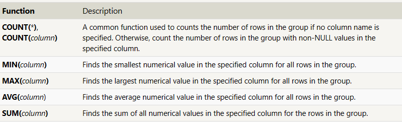

Queries with aggregates

SQL permite el uso de expresiones o funciones agregadas, las cuales ayudan a poder sintetizar toda la informacion en grupos de informacion

```bash
SELECT AGG_FUNC(column_or_expression) AS aggregate_description, …
FROM mytable
WHERE constraint_expression;
```


Tambien se le puede hacer a grupos individuales de datos
```bash
SELECT AGG_FUNC(column_or_expression) AS aggregate_description, …
FROM mytable
WHERE constraint_expression
GROUP BY column;
```


