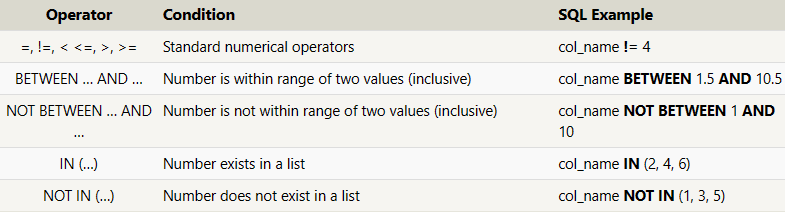
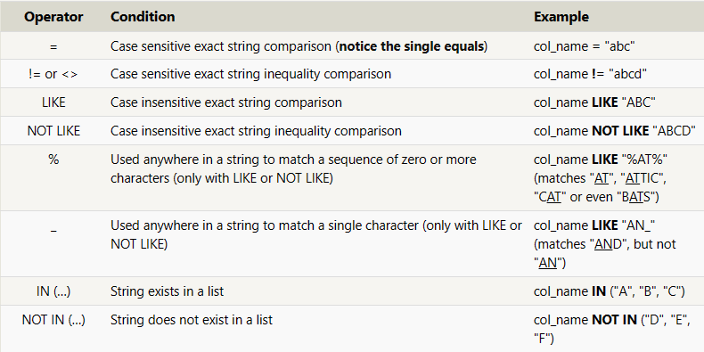

REGLAS Y RESTRICCIONES

Como en una base de datos tenemos mucha informacion, y dependiendo de la base de datos se puede demorar mucho entraer toda la informacion por lo cual hay que filtrar para asegurarnos de traer solo la informacion necesaria

Para eso usamos la clausula *WHERE*.
SELECT column, another_column, …
FROM mytable
WHERE condition
    AND/OR another_condition
    AND/OR …;
    

En este caso de las restricciones que se tienen  en cuenta son:
- "=" devuelve exactamente lo que este dentro de las comillas.
- "!=" Devolvera donde no este presente lo que se coloco dentro de las comillas
- "LIKE" Este no diferencia entre mayusculas y minusculas como las anteriores, pero traera los valores que sean parecidos al que este dentro de las comillas
- "NOT LIKE" todo lo contrario a LIKE
- "%" si se tiene al comienzo y al final de las comillas con la palabra traera todas las que coincidan con estas

Select query with constraints
SELECT column, another_column, …
FROM mytable
WHERE condition
    AND/OR another_condition
    AND/OR …;
 