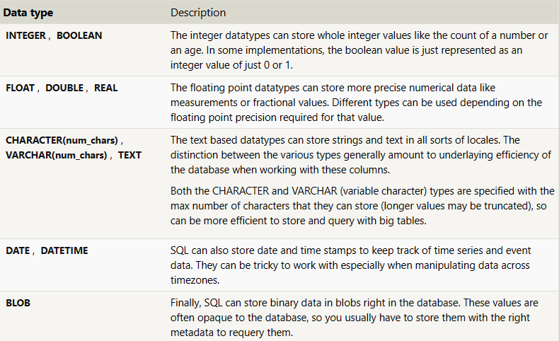
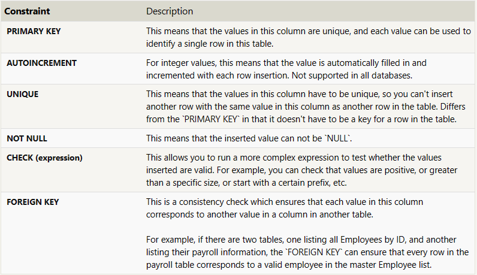

Para poder crear una base de datos se usa el estado **CREATE TABLE ** 
```sql
CREATE TABLE IF NOT EXISTS mytable (
    column DataType TableConstraint DEFAULT default_value,
    another_column DataType TableConstraint DEFAULT default_value,
    …
);
```

La estructura de una base de datos se basa en una serie de columnas las cuales se van creando, cada columna tiene un nombre, un tipo de dato, este tipo de dato es lo que permite saber que es lo que va a aceptar como parametro, un constrain es un parametro en el cual defines ya sea el tamaño de longitud de la sentencia o mas, y por ultimo un valor default

Tipos de datos:


-Enteros o Booleanos
    -Guarda valores los cuales vienen siendo enteros o en el caso de ser 1 o un 0
-Flotantes, Dobles o Reales
    -Guarda lo que seria numeros mas preciosas, con decimales, ya sea fraccionarios o mas
-Caracteres,  Cadenas o Strings
    -Guardan cadenas de textos 
-Date, Datetime
    -Guarda el tiempo en el cual fue creado
-Blob
    -Guarda datos binarios

Constraints tablas:


-PRIMARY KEY
    -Es la llave primaria de la base de datos, lo cual quiere decir que es unica para cada valor en la base de datos
-AUTOINCREMENT
    -Incrementa cada vez que se un nuevo dato agregado a la base de datos
-UNIQUE
    -Indica que el valor es unico y no se le puede añadir otro valor con ese mismo nombre o valor
-NOT NULL
    -No puede tener valores nulos
-CHECK
    -Ayuda a hacer una validacion en caso de que sea necesario para el tipo de valor el cual se esta agregando
-FOREIGN KEY
    -Se utiliza para relacionar dos tablas entre si, por ejemplo si tenemos una con la informacion y se tiene  otra con la informacion del cliente, une por una variable estas dos

```sql
CREATE TABLE movies (
    id INTEGER PRIMARY KEY,
    title TEXT,
    director TEXT,
    year INTEGER, 
    length_minutes INTEGER
);
```